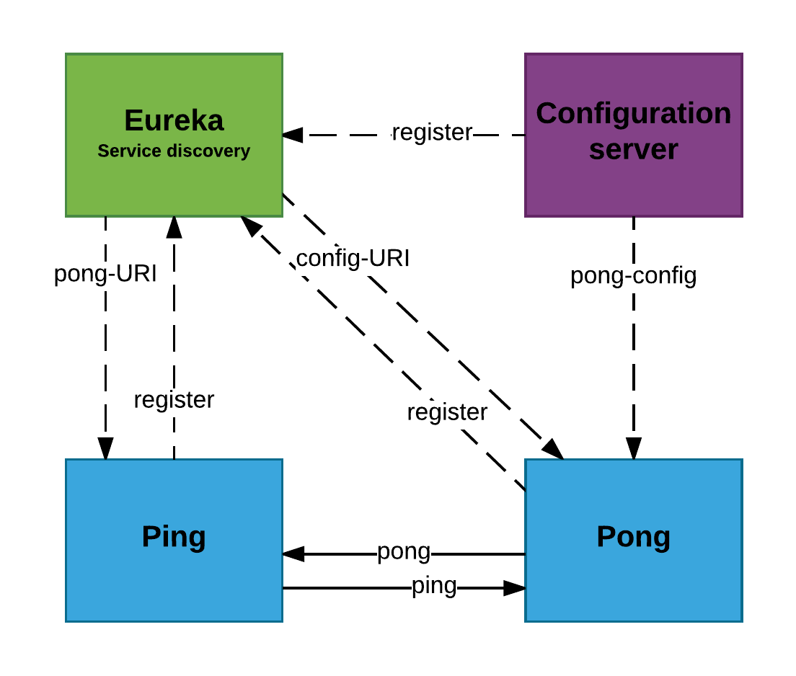

# Simple Spring Cloud Dockerized app

This is application based on Microservices Architecture.
Entire application can be run:
- on typical machine (virtual, local, bare-metal etc...)
- on Docker

For Docker maven-docker-plugin is used which can be found here: https://github.com/spotify/docker-maven-plugin

## Services
Application consists of four microservices:
- discovery service (Eureka)
- configuration service (Spring Cloud Config)
- Ping service
- Pong service
Moreover it uses _commons_ module to reuse components.

Overall design and connection between services looks following:


## Endpoints
- http://${ping-service-host:ping-service-port}/ping?content=SOME_STRING (i.e. _http://localhost:8080/ping_)
- http://${eureka-service-host:eureka-service-port} (i.e. _http://localhost:8761_)
- http://${config-service-host:config-service-port} (i.e. _http://localhost:7070_)
- POST http://${pong-service-host:pong-service-port}/pong?input=SOME_STRING (i.e. POST to _http://localhost:8082/pong_)
When running docker locally using docker-machine execute ```docker-machine url``` to get URL of running container and then use it to connect to given service.

## Running application
To run this app you need following:
1. Apache Maven 3+
2. Docker with Docker Compose (only when going for Docker)

### On typical machine
__Option #1:__
Execute ```run_local.bat``` which underneath builds each module, installs maven dependencies and runs each service. Use ```-s``` to turn off installing dependencies to you local repo.

__Option #2:__
Is a manual version of option #1.
```
mvn clean install
mvn -f eureka-micro/pom.xml spring-boot:run
mvn -f config-micro/pom.xml spring-boot:run
mvn -f ping-micro/pom.xml spring-boot:run
mvn -f pong-micro/pom.xml spring-boot:run
```

### On Docker

## TODO
- Create API Gateway to simplify visible endpoints
- Add database(s) to show how Dockerize dbs
- Add pushing to private registry after build
- Add description how to use it on Bamboo / CD pipeline


